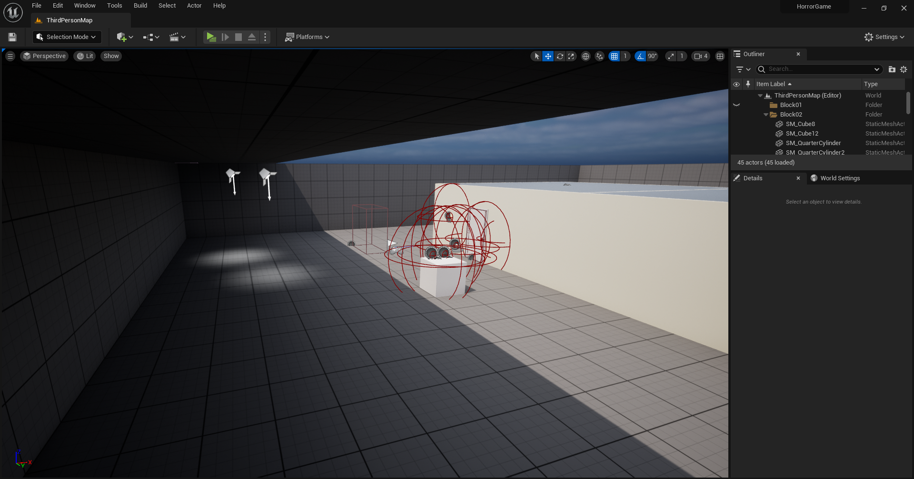

# Survival Horror UE

---

## Overview

**Survival Horror UE** è un progetto _**in sviluppo**_ realizzato con Unreal Engine, progettato come vertical slice di un’esperienza survival horror moderna ispirata ai classici del genere.

Il focus principale è sulla costruzione della tensione attraverso level design, gestione delle risorse e sistemi di gioco modulari. Il progetto punta a dimostrare competenze tecniche nella progettazione di gameplay systems, AI comportamentale e ottimizzazione in real-time.

---

## Key Features

* Gameplay loop survival horror basato su esplorazione, combattimento e puzzle
* Sistema di inventario con gestione limitata delle risorse
* Sistema di note collezionabili per narrativa ambientale
* Sistema di interazione basato su raycast
* Sistema di slot per oggetti _(**in corso**)_
* Enemy AI con stati comportamentali dinamici _(**in sviluppo**)_
* Level design interconnesso con backtracking _(**in sviluppo**)_
* Atmosfera costruita tramite lighting dinamico e audio spaziale _(**in sviluppo**)_
* Architettura modulare scalabile _(**in sviluppo**)_

---

## Gameplay

Il gameplay è costruito attorno a:

* **Exploration-driven progression**: avanzamento tramite scoperta e risoluzione di enigmi _(**in corso**)_
* **Resource management**: munizioni e oggetti limitati  _(**in corso**)_
* **Deliberate combat design**: combattimento intenzionalmente lento e rischioso _(**in sviluppo**)_
* **Environmental storytelling**: narrativa integrata negli ambienti _(**in sviluppo**)_
* **Tension pacing**: alternanza tra calma e pericolo _(**in sviluppo**)_

---

## Systems Architecture

Il progetto è strutturato secondo un’architettura modulare per garantire scalabilità e manutenibilità.

**Core Systems:**

* **Player Controller**
  Gestione input, movimento, interazioni e stato del player

* **Inventory System**
  Sistema implementato per la gestione degli oggetti, con supporto a raccolta e utilizzo
  
* **Note System**
  Sistema per la raccolta e visualizzazione di documenti/note per storytelling ambientale
  
* **Interaction System**
  Sistema basato su raycast per l’interazione con oggetti nel mondo di gioco

* **Save System**  _(**in sviluppo**)_
  Persistenza dei dati di gioco e checkpoint
  
* **Enemy AI System** _(**in sviluppo**)_
  AI basata su Behavior Trees con stati: Idle, Patrol, Alert, Chase, Attack

* **Game State Manager** _(**in sviluppo**)_
  FSM semplificata per controllo stati globali

## Technical Highlights

* **Unreal Engine (Blueprint)**
* Behavior Trees per AI _(**in sviluppo**)_
* Event-driven architecture (Event Dispatchers) _(**in sviluppo**)_
* Dynamic lighting per mood e leggibilità _(**in sviluppo**)_
* Spatial audio per immersione _(**in sviluppo**)_
* Collision & interaction system modulare _(**in sviluppo**)_
* Ottimizzazione per ambienti indoor _(**in sviluppo**)_

---

## Goals

Questo progetto è stato sviluppato per dimostrare:

* Progettazione di sistemi di gioco modulari
* Implementazione di AI comportamentale
* Costruzione di atmosfera in un contesto horror
* Capacità di sviluppo end-to-end in Unreal Engine

---

## Notes

Il progetto è attualmente in fase di sviluppo attivo.

Stato attuale:

* Sistemi core (Inventory, Interaction, Note System) implementati
* Sistema slot in fase di sviluppo
* AI, level design avanzato e atmosfera ancora in lavorazione

---
